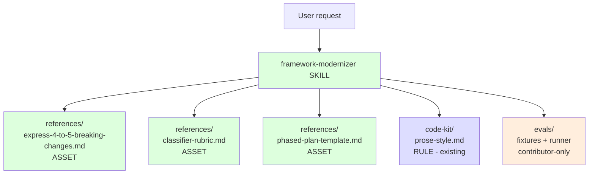
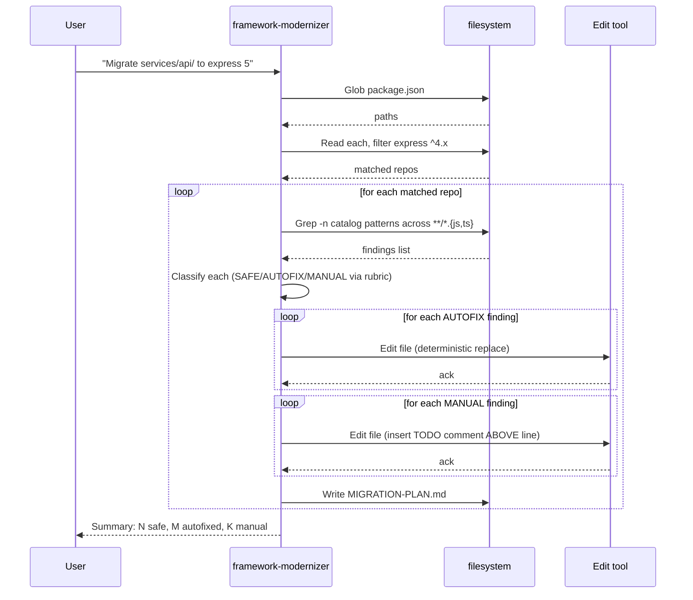

# Genesis design handoff packet — framework-modernizer

> Output of the [Genesis](https://github.com/DevExpGbb/genesis) 8-step design discipline. Persisted here so reviewers (and trainees adapting this pattern to other framework migrations) can reproduce the reasoning.

## Step 1 — intent + scope

**Capability:** Audit a Node.js codebase for Express 4 → 5 breaking changes, classify each finding, apply safe autofixes, and emit a phased migration plan grounded in the official Express 5 migration guide.

**Single Responsibility check:** "audit AND fix AND plan" is one capability — *prepare a codebase for a major-version upgrade*. Splitting would cost more than it saves (audit alone is useless without a plan; autofix alone is dangerous without classification). PASS.

**Boundary (what it does NOT do):**
- Does not bump `express` in `package.json` (deliberate human gate — bumping invalidates the lockfile).
- Does not run `npm test` (the team's CI is the oracle).
- Does not handle other frameworks (one framework pair per skill — see "Forking this pattern" below).

**Dispatch description (frontmatter `description`):** Imperative ("Use this skill when…"), names indirect triggers ("bump express to v5", "express deprecation warnings", "stuck on express 4"), declares boundary ("does NOT run consumer's tests"). Mode: BOTH (forced when explicitly invoked, discovery when express ^4.x detected in package.json being discussed).

## Step 2 — component diagram

## Step 3 — sequence diagram

**Pattern selection (genesis tier order):**

1. **Refactor patterns:** None apply (greenfield skill).
2. **TIER 3 architectural pattern:** **PIPELINE** (genesis A2). Single-pass, deterministic stages, no fan-out. Anti-patterns inherited: don't add a "fix" stage that re-reads what the "scan" stage already saw (state-loss).
3. **TIER 2 design patterns:** **B4 PLAN MEMENTO** (the MIGRATION-PLAN.md is the persisted plan); **B8 ATTENTION ANCHOR** (catalog file is THE source of truth — every finding must cite a BC-NNN).
4. **TIER 1 idioms:** Loaded only at codegen — not relevant in design.

**Why not PANEL?** No independent lenses. Classification is mechanical (rubric is deterministic), not a judgment call. PANEL would be over-engineering.

## Step 3.5 — composition decision

| Box | Mode | Rationale |
|---|---|---|
| catalog (`express-4-to-5-breaking-changes.md`) | INLINE asset | Skill-specific. No other skill reuses Express 5 patterns. |
| rubric (`classifier-rubric.md`) | INLINE asset | The 3-class taxonomy is specific to migration skills; could be EXTERNAL if a 2nd migration skill ships, but rule-of-three not yet met. |
| plan template (`phased-plan-template.md`) | INLINE asset | Skill-specific output format. |
| prose-style | EXTERNAL (already pinned via `code-kit`) | Cross-cutting style rules; shared across all repo skills. |
| evals fixture + runner | LOCAL SIBLING but **OUTSIDE** distribution boundary | Eval scenarios are maintainer-scope. Trainees should NOT load them at runtime. Lives under `.apm/skills/framework-modernizer/evals/` — `apm pack` excludes by convention. |

No external modules required → no module-system adapter needed.

## Step 4 — SoC pass

| Existing module | Overlap? |
|---|---|
| `code-kit` (style + lint instructions) | No — this skill is task-specific, not style. |
| `review-kit` (PR review) | No — review-kit reviews diffs after the fact; this skill prepares the diff. |
| `secure-baseline` (secret hooks) | No — orthogonal. |

**Verdict:** Net new capability. No SoC violation.

## Step 5 — PROSE compliance check

PROSE = **P**rogressive Disclosure / **R**educed Scope / **O**rchestrated Composition / **S**afety Boundaries / **E**xplicit Hierarchy ([handbook ch.12](https://danielmeppiel.github.io/agentic-sdlc-handbook/handbook/ch12-the-prose-specification.html#the-constraint-model)). One row per constraint:

| PROSE constraint | How this skill complies |
|---|---|
| **P**rogressive Disclosure | `SKILL.md` is ~80 lines (when-to-use + 5 steps). Catalog, rubric and plan template live under `references/` and are only loaded when the skill is invoked — not at every chat turn. |
| **R**educed Scope | Single capability: "produce a triaged migration plan for one named framework upgrade". Doesn't refactor, doesn't open PRs, doesn't bump anything else. Anything outside that is a separate skill. |
| **O**rchestrated Composition | PIPELINE shape: `discover repo footprint → scan catalog → classify per BC-NNN → emit plan`. Each step is a deterministic call (Grep / Read / templated Edit) wrapped by the LLM. Composes cleanly with `code-kit` (style on the plan output) and `review-kit` (review of the resulting PR). |
| **S**afety Boundaries | `allowed-tools: Read, Grep, Glob, Edit(plan.md)` only — cannot touch source. Catalog is the **only** ground truth for breaking changes; "Constraints" bans inventing BC-NNNs from training data. Eval fixture verifies every finding cites a BC-NNN that exists in the catalog. |
| **E**xplicit Hierarchy | Repo `code-kit` rules > skill-local rubric > skill instructions > prompt. The skill never overrides the repo's house style; it inherits it. |

**Hallucination countermeasure:** The "Constraints" section bans inventing breaking changes from training data. The catalog is the only source of truth. Eval fixture verifies findings cite a BC-NNN.

**LLM-physics:** Catalog is ~6.5KB, rubric ~2KB, plan template ~3KB. Total skill loadout ~17KB including SKILL.md. Comfortably under 32KB context-economy budget.

## Step 6 — handoff packet (this file)

✅ Component diagram (step 2)
✅ Sequence diagram (step 3)
✅ Pattern named (PIPELINE) + anti-patterns inherited
✅ Composition decisions per box
✅ External modules required: none
✅ Distribution surface: `.apm/skills/framework-modernizer/{SKILL.md, references/*}` ships; `evals/` does not.

## Step 7 — codegen (separate file, this is `SKILL.md`)

Done. See `../SKILL.md`.

## Step 8 — validation

✅ Diagrams written before SKILL.md body (Rule 1).
✅ No harness-specific syntax in SKILL.md or this design doc (Rule 2). Tools named only generically (`Read`, `Grep`, `Glob`, `Edit`, `Bash`).
✅ Single coherent unit — every section serves the migration capability; no orphan content.
✅ Size budget under 32KB total loadout.
✅ Eval fixture exists and runs (see `../evals/README.md`).

---

## Forking this pattern for other frameworks

The architecture transfers verbatim. To adapt for, say, **React 17 → 18**:

1. Replace `express-4-to-5-breaking-changes.md` with `react-17-to-18-breaking-changes.md` — extract from React 18 migration guide.
2. Same rubric (SAFE / AUTOFIX / MANUAL).
3. Same plan template (rename headings).
4. Same PIPELINE pattern, same sequence diagram (only the catalog content changes).
5. New eval fixture with deliberate React 17 patterns.

The trainee track guide ([`docs/tracks/04-framework-modernizer.md`](../../../../docs/tracks/04-framework-modernizer.md)) walks through this fork explicitly.
